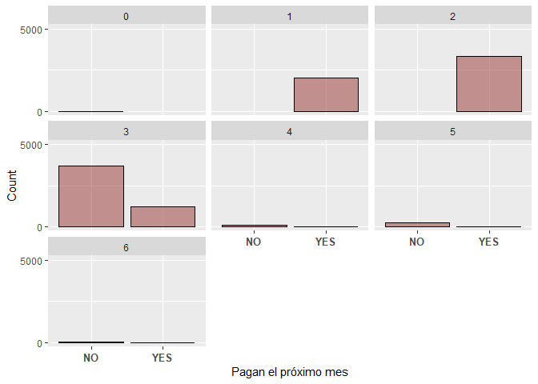

Ayudantía 10
================

``` r
library(dplyr)
```

    ## Warning: package 'dplyr' was built under R version 4.0.5

    ## 
    ## Attaching package: 'dplyr'

    ## The following objects are masked from 'package:stats':
    ## 
    ##     filter, lag

    ## The following objects are masked from 'package:base':
    ## 
    ##     intersect, setdiff, setequal, union

``` r
library(tidyverse)
```

    ## Warning: package 'tidyverse' was built under R version 4.0.5

    ## -- Attaching packages --------------------------------------- tidyverse 1.3.1 --

    ## v ggplot2 3.3.4     v purrr   0.3.4
    ## v tibble  3.1.2     v stringr 1.4.0
    ## v tidyr   1.1.3     v forcats 0.5.1
    ## v readr   1.4.0

    ## Warning: package 'ggplot2' was built under R version 4.0.5

    ## Warning: package 'tibble' was built under R version 4.0.5

    ## Warning: package 'tidyr' was built under R version 4.0.5

    ## Warning: package 'readr' was built under R version 4.0.3

    ## Warning: package 'stringr' was built under R version 4.0.3

    ## Warning: package 'forcats' was built under R version 4.0.5

    ## -- Conflicts ------------------------------------------ tidyverse_conflicts() --
    ## x dplyr::filter() masks stats::filter()
    ## x dplyr::lag()    masks stats::lag()

``` r
library (ggplot2)
library(datasets)
library(pROC)
```

    ## Warning: package 'pROC' was built under R version 4.0.5

    ## Type 'citation("pROC")' for a citation.

    ## 
    ## Attaching package: 'pROC'

    ## The following objects are masked from 'package:stats':
    ## 
    ##     cov, smooth, var

``` r
library(discrim)
```

    ## Warning: package 'discrim' was built under R version 4.0.5

    ## Loading required package: parsnip

    ## Warning: package 'parsnip' was built under R version 4.0.5

``` r
library(plyr)
```

    ## Warning: package 'plyr' was built under R version 4.0.3

    ## ------------------------------------------------------------------------------

    ## You have loaded plyr after dplyr - this is likely to cause problems.
    ## If you need functions from both plyr and dplyr, please load plyr first, then dplyr:
    ## library(plyr); library(dplyr)

    ## ------------------------------------------------------------------------------

    ## 
    ## Attaching package: 'plyr'

    ## The following object is masked from 'package:purrr':
    ## 
    ##     compact

    ## The following objects are masked from 'package:dplyr':
    ## 
    ##     arrange, count, desc, failwith, id, mutate, rename, summarise,
    ##     summarize

``` r
library(caret)
```

    ## Warning: package 'caret' was built under R version 4.0.5

    ## Loading required package: lattice

    ## 
    ## Attaching package: 'caret'

    ## The following object is masked from 'package:purrr':
    ## 
    ##     lift

``` r
library(tidymodels)
```

    ## Warning: package 'tidymodels' was built under R version 4.0.5

    ## Registered S3 method overwritten by 'tune':
    ##   method                   from   
    ##   required_pkgs.model_spec parsnip

    ## -- Attaching packages -------------------------------------- tidymodels 0.1.3 --

    ## v broom        0.7.7      v rsample      0.1.0 
    ## v dials        0.0.9      v tune         0.1.5 
    ## v infer        0.5.4      v workflows    0.2.2 
    ## v modeldata    0.1.0      v workflowsets 0.0.2 
    ## v recipes      0.1.16     v yardstick    0.0.8

    ## Warning: package 'broom' was built under R version 4.0.5

    ## Warning: package 'dials' was built under R version 4.0.5

    ## Warning: package 'infer' was built under R version 4.0.5

    ## Warning: package 'modeldata' was built under R version 4.0.5

    ## Warning: package 'recipes' was built under R version 4.0.5

    ## Warning: package 'rsample' was built under R version 4.0.5

    ## Warning: package 'tune' was built under R version 4.0.5

    ## Warning: package 'workflows' was built under R version 4.0.5

    ## Warning: package 'workflowsets' was built under R version 4.0.5

    ## Warning: package 'yardstick' was built under R version 4.0.5

    ## -- Conflicts ----------------------------------------- tidymodels_conflicts() --
    ## x plyr::arrange()          masks dplyr::arrange()
    ## x plyr::compact()          masks purrr::compact()
    ## x plyr::count()            masks dplyr::count()
    ## x scales::discard()        masks purrr::discard()
    ## x plyr::failwith()         masks dplyr::failwith()
    ## x dplyr::filter()          masks stats::filter()
    ## x recipes::fixed()         masks stringr::fixed()
    ## x plyr::id()               masks dplyr::id()
    ## x dplyr::lag()             masks stats::lag()
    ## x caret::lift()            masks purrr::lift()
    ## x plyr::mutate()           masks dplyr::mutate()
    ## x yardstick::precision()   masks caret::precision()
    ## x yardstick::recall()      masks caret::recall()
    ## x plyr::rename()           masks dplyr::rename()
    ## x yardstick::sensitivity() masks caret::sensitivity()
    ## x yardstick::spec()        masks readr::spec()
    ## x yardstick::specificity() masks caret::specificity()
    ## x recipes::step()          masks stats::step()
    ## x plyr::summarise()        masks dplyr::summarise()
    ## x plyr::summarize()        masks dplyr::summarize()
    ## * Use tidymodels_prefer() to resolve common conflicts.

``` r
library(tidyverse)
library(e1071)
```

    ## Warning: package 'e1071' was built under R version 4.0.5

    ## 
    ## Attaching package: 'e1071'

    ## The following object is masked from 'package:tune':
    ## 
    ##     tune

    ## The following object is masked from 'package:rsample':
    ## 
    ##     permutations

``` r
library(rstan)
```

    ## Warning: package 'rstan' was built under R version 4.0.5

    ## Loading required package: StanHeaders

    ## Warning: package 'StanHeaders' was built under R version 4.0.5

    ## rstan (Version 2.21.2, GitRev: 2e1f913d3ca3)

    ## For execution on a local, multicore CPU with excess RAM we recommend calling
    ## options(mc.cores = parallel::detectCores()).
    ## To avoid recompilation of unchanged Stan programs, we recommend calling
    ## rstan_options(auto_write = TRUE)

    ## Do not specify '-march=native' in 'LOCAL_CPPFLAGS' or a Makevars file

    ## 
    ## Attaching package: 'rstan'

    ## The following object is masked from 'package:tidyr':
    ## 
    ##     extract

``` r
library(rstanarm)
```

    ## Warning: package 'rstanarm' was built under R version 4.0.5

    ## Loading required package: Rcpp

    ## Warning: package 'Rcpp' was built under R version 4.0.5

    ## 
    ## Attaching package: 'Rcpp'

    ## The following object is masked from 'package:rsample':
    ## 
    ##     populate

    ## This is rstanarm version 2.21.1

    ## - See https://mc-stan.org/rstanarm/articles/priors for changes to default priors!

    ## - Default priors may change, so it's safest to specify priors, even if equivalent to the defaults.

    ## - For execution on a local, multicore CPU with excess RAM we recommend calling

    ##   options(mc.cores = parallel::detectCores())

    ## 
    ## Attaching package: 'rstanarm'

    ## The following object is masked from 'package:rstan':
    ## 
    ##     loo

    ## The following objects are masked from 'package:caret':
    ## 
    ##     compare_models, R2

``` r
library(rpart)
```

    ## Warning: package 'rpart' was built under R version 4.0.5

    ## 
    ## Attaching package: 'rpart'

    ## The following object is masked from 'package:dials':
    ## 
    ##     prune

``` r
library(rpart.plot)
```

    ## Warning: package 'rpart.plot' was built under R version 4.0.5

### Cargamos la data:

``` r
data = read.csv(file.choose())
summary(data)
```

    ##        ID          LIMIT_BAL            SEX          EDUCATION    
    ##  Min.   :    1   Min.   :  10000   Min.   :1.000   Min.   :0.000  
    ##  1st Qu.: 7501   1st Qu.:  50000   1st Qu.:1.000   1st Qu.:1.000  
    ##  Median :15000   Median : 140000   Median :2.000   Median :2.000  
    ##  Mean   :15000   Mean   : 167484   Mean   :1.604   Mean   :1.853  
    ##  3rd Qu.:22500   3rd Qu.: 240000   3rd Qu.:2.000   3rd Qu.:2.000  
    ##  Max.   :30000   Max.   :1000000   Max.   :2.000   Max.   :6.000  
    ##     MARRIAGE          AGE            PAY_0             PAY_2        
    ##  Min.   :0.000   Min.   :21.00   Min.   :-2.0000   Min.   :-2.0000  
    ##  1st Qu.:1.000   1st Qu.:28.00   1st Qu.:-1.0000   1st Qu.:-1.0000  
    ##  Median :2.000   Median :34.00   Median : 0.0000   Median : 0.0000  
    ##  Mean   :1.552   Mean   :35.49   Mean   :-0.0167   Mean   :-0.1338  
    ##  3rd Qu.:2.000   3rd Qu.:41.00   3rd Qu.: 0.0000   3rd Qu.: 0.0000  
    ##  Max.   :3.000   Max.   :79.00   Max.   : 8.0000   Max.   : 8.0000  
    ##      PAY_3             PAY_4             PAY_5             PAY_6        
    ##  Min.   :-2.0000   Min.   :-2.0000   Min.   :-2.0000   Min.   :-2.0000  
    ##  1st Qu.:-1.0000   1st Qu.:-1.0000   1st Qu.:-1.0000   1st Qu.:-1.0000  
    ##  Median : 0.0000   Median : 0.0000   Median : 0.0000   Median : 0.0000  
    ##  Mean   :-0.1662   Mean   :-0.2207   Mean   :-0.2662   Mean   :-0.2911  
    ##  3rd Qu.: 0.0000   3rd Qu.: 0.0000   3rd Qu.: 0.0000   3rd Qu.: 0.0000  
    ##  Max.   : 8.0000   Max.   : 8.0000   Max.   : 8.0000   Max.   : 8.0000  
    ##    BILL_AMT1         BILL_AMT2        BILL_AMT3         BILL_AMT4      
    ##  Min.   :-165580   Min.   :-69777   Min.   :-157264   Min.   :-170000  
    ##  1st Qu.:   3559   1st Qu.:  2985   1st Qu.:   2666   1st Qu.:   2327  
    ##  Median :  22382   Median : 21200   Median :  20089   Median :  19052  
    ##  Mean   :  51223   Mean   : 49179   Mean   :  47013   Mean   :  43263  
    ##  3rd Qu.:  67091   3rd Qu.: 64006   3rd Qu.:  60165   3rd Qu.:  54506  
    ##  Max.   : 964511   Max.   :983931   Max.   :1664089   Max.   : 891586  
    ##    BILL_AMT5        BILL_AMT6          PAY_AMT1         PAY_AMT2      
    ##  Min.   :-81334   Min.   :-339603   Min.   :     0   Min.   :      0  
    ##  1st Qu.:  1763   1st Qu.:   1256   1st Qu.:  1000   1st Qu.:    833  
    ##  Median : 18105   Median :  17071   Median :  2100   Median :   2009  
    ##  Mean   : 40311   Mean   :  38872   Mean   :  5664   Mean   :   5921  
    ##  3rd Qu.: 50191   3rd Qu.:  49198   3rd Qu.:  5006   3rd Qu.:   5000  
    ##  Max.   :927171   Max.   : 961664   Max.   :873552   Max.   :1684259  
    ##     PAY_AMT3         PAY_AMT4         PAY_AMT5           PAY_AMT6       
    ##  Min.   :     0   Min.   :     0   Min.   :     0.0   Min.   :     0.0  
    ##  1st Qu.:   390   1st Qu.:   296   1st Qu.:   252.5   1st Qu.:   117.8  
    ##  Median :  1800   Median :  1500   Median :  1500.0   Median :  1500.0  
    ##  Mean   :  5226   Mean   :  4826   Mean   :  4799.4   Mean   :  5215.5  
    ##  3rd Qu.:  4505   3rd Qu.:  4013   3rd Qu.:  4031.5   3rd Qu.:  4000.0  
    ##  Max.   :896040   Max.   :621000   Max.   :426529.0   Max.   :528666.0  
    ##  default.payment.next.month
    ##  Min.   :0.0000            
    ##  1st Qu.:0.0000            
    ##  Median :0.0000            
    ##  Mean   :0.2212            
    ##  3rd Qu.:0.0000            
    ##  Max.   :1.0000

Limpiamos la data y arreglamos variables.

``` r
sapply(data, function(x)sum(is.na(x)))
```

    ##                         ID                  LIMIT_BAL 
    ##                          0                          0 
    ##                        SEX                  EDUCATION 
    ##                          0                          0 
    ##                   MARRIAGE                        AGE 
    ##                          0                          0 
    ##                      PAY_0                      PAY_2 
    ##                          0                          0 
    ##                      PAY_3                      PAY_4 
    ##                          0                          0 
    ##                      PAY_5                      PAY_6 
    ##                          0                          0 
    ##                  BILL_AMT1                  BILL_AMT2 
    ##                          0                          0 
    ##                  BILL_AMT3                  BILL_AMT4 
    ##                          0                          0 
    ##                  BILL_AMT5                  BILL_AMT6 
    ##                          0                          0 
    ##                   PAY_AMT1                   PAY_AMT2 
    ##                          0                          0 
    ##                   PAY_AMT3                   PAY_AMT4 
    ##                          0                          0 
    ##                   PAY_AMT5                   PAY_AMT6 
    ##                          0                          0 
    ## default.payment.next.month 
    ##                          0

``` r
data_limpia=na.omit(data)
data_limpia=mutate(data_limpia, default.payment.next.month=as.factor(default.payment.next.month), SEX=as.factor(SEX), MARRIAGE=as.factor(MARRIAGE), EDUCATION=as.factor(EDUCATION))
str(data_limpia)
```

    ## 'data.frame':    30000 obs. of  25 variables:
    ##  $ ID                        : int  1 2 3 4 5 6 7 8 9 10 ...
    ##  $ LIMIT_BAL                 : num  20000 120000 90000 50000 50000 50000 500000 100000 140000 20000 ...
    ##  $ SEX                       : Factor w/ 2 levels "1","2": 2 2 2 2 1 1 1 2 2 1 ...
    ##  $ EDUCATION                 : Factor w/ 7 levels "0","1","2","3",..: 3 3 3 3 3 2 2 3 4 4 ...
    ##  $ MARRIAGE                  : Factor w/ 4 levels "0","1","2","3": 2 3 3 2 2 3 3 3 2 3 ...
    ##  $ AGE                       : int  24 26 34 37 57 37 29 23 28 35 ...
    ##  $ PAY_0                     : int  2 -1 0 0 -1 0 0 0 0 -2 ...
    ##  $ PAY_2                     : int  2 2 0 0 0 0 0 -1 0 -2 ...
    ##  $ PAY_3                     : int  -1 0 0 0 -1 0 0 -1 2 -2 ...
    ##  $ PAY_4                     : int  -1 0 0 0 0 0 0 0 0 -2 ...
    ##  $ PAY_5                     : int  -2 0 0 0 0 0 0 0 0 -1 ...
    ##  $ PAY_6                     : int  -2 2 0 0 0 0 0 -1 0 -1 ...
    ##  $ BILL_AMT1                 : num  3913 2682 29239 46990 8617 ...
    ##  $ BILL_AMT2                 : num  3102 1725 14027 48233 5670 ...
    ##  $ BILL_AMT3                 : num  689 2682 13559 49291 35835 ...
    ##  $ BILL_AMT4                 : num  0 3272 14331 28314 20940 ...
    ##  $ BILL_AMT5                 : num  0 3455 14948 28959 19146 ...
    ##  $ BILL_AMT6                 : num  0 3261 15549 29547 19131 ...
    ##  $ PAY_AMT1                  : num  0 0 1518 2000 2000 ...
    ##  $ PAY_AMT2                  : num  689 1000 1500 2019 36681 ...
    ##  $ PAY_AMT3                  : num  0 1000 1000 1200 10000 657 38000 0 432 0 ...
    ##  $ PAY_AMT4                  : num  0 1000 1000 1100 9000 ...
    ##  $ PAY_AMT5                  : num  0 0 1000 1069 689 ...
    ##  $ PAY_AMT6                  : num  0 2000 5000 1000 679 ...
    ##  $ default.payment.next.month: Factor w/ 2 levels "0","1": 2 2 1 1 1 1 1 1 1 1 ...

## Visualización de datos:

``` r
ggplot(data = data_limpia,aes(factor(default.payment.next.month)))+
  geom_bar( col='black', fill="#993333", alpha = 0.5) +
  facet_wrap(~EDUCATION) +
  scale_x_discrete("Pagan el próximo mes",labels = c("NO","YES")) +
  scale_y_continuous("Count",limits = c(0,5000),breaks=seq(0,47222,by=5000))  +
  theme(axis.text.x = element_text(face="bold", size=10))
```

    ## Warning: Removed 2 rows containing missing values (geom_bar).

<!-- --> Analisamos el
nivel de pago de los clientes a raíz de su educación, donde (1=graduate
school, 2=university, 3=high school, 4=others, 5=unknown, 6=unknown)

``` r
ggplot(data_limpia,aes(x=factor(AGE))) +
  geom_bar(col ="black",fill="#993333",alpha=0.5) +
  theme(axis.text.x = element_text(face="bold", size=10)) +
  scale_x_discrete("Hotel") +
  scale_y_continuous("Count")
```

<!-- --> Podemos
observar que la mayoría de las personas de las cuales se tiene
información son adultos jóvenes.

### Creamo train y test data:

``` r
data_split <- initial_split(data_limpia, prop = 0.8)

train_data <- training(data_split) 
test_data <- testing(data_split)

str(train_data)
```

    ## 'data.frame':    24000 obs. of  25 variables:
    ##  $ ID                        : int  27881 8565 29635 24877 28498 9324 23978 4732 10262 4442 ...
    ##  $ LIMIT_BAL                 : num  130000 200000 210000 410000 330000 500000 40000 40000 80000 50000 ...
    ##  $ SEX                       : Factor w/ 2 levels "1","2": 2 2 1 1 2 1 1 1 2 1 ...
    ##  $ EDUCATION                 : Factor w/ 7 levels "0","1","2","3",..: 4 4 2 3 3 3 2 4 3 3 ...
    ##  $ MARRIAGE                  : Factor w/ 4 levels "0","1","2","3": 2 3 3 2 2 2 3 3 3 2 ...
    ##  $ AGE                       : int  26 33 31 46 37 39 26 42 26 49 ...
    ##  $ PAY_0                     : int  0 -1 0 2 0 0 0 -1 0 0 ...
    ##  $ PAY_2                     : int  0 -1 0 2 0 0 0 2 0 0 ...
    ##  $ PAY_3                     : int  2 -1 0 2 0 0 0 -1 0 0 ...
    ##  $ PAY_4                     : int  2 0 0 2 0 0 0 0 0 0 ...
    ##  $ PAY_5                     : int  2 -1 0 2 0 0 0 0 0 0 ...
    ##  $ PAY_6                     : int  0 -1 0 0 0 0 0 -1 0 0 ...
    ##  $ BILL_AMT1                 : num  121329 834 36042 71532 46348 ...
    ##  $ BILL_AMT2                 : num  128791 165 37141 73643 37052 ...
    ##  $ BILL_AMT3                 : num  127881 6682 38179 72083 36228 ...
    ##  $ BILL_AMT4                 : num  133130 16045 39243 76603 37833 ...
    ##  $ BILL_AMT5                 : num  127159 4679 39740 74964 37694 ...
    ##  $ BILL_AMT6                 : num  131069 280 40574 76370 41269 ...
    ##  $ PAY_AMT1                  : num  11000 165 2000 3700 1574 ...
    ##  $ PAY_AMT2                  : num  2600 6682 1936 0 1640 ...
    ##  $ PAY_AMT3                  : num  9000 10000 2000 6147 3000 ...
    ##  $ PAY_AMT4                  : num  0 4679 1450 0 3000 ...
    ##  $ PAY_AMT5                  : num  6000 280 1472 2577 4016 ...
    ##  $ PAY_AMT6                  : num  5000 0 3500 2747 2049 ...
    ##  $ default.payment.next.month: Factor w/ 2 levels "0","1": 1 1 1 2 1 2 1 1 1 1 ...

### Creamos receta:

``` r
receta <- 
  recipe(default.payment.next.month ~ AGE+MARRIAGE+SEX+ PAY_0+PAY_AMT1, data = train_data)

receta 
```

    ## Data Recipe
    ## 
    ## Inputs:
    ## 
    ##       role #variables
    ##    outcome          1
    ##  predictor          5

``` r
modelo_trees <-
  decision_tree(tree_depth = 5, min_n = 10) %>% 
  set_engine("rpart") %>% 
  set_mode("classification")

modelo_trees
```

    ## Decision Tree Model Specification (classification)
    ## 
    ## Main Arguments:
    ##   tree_depth = 5
    ##   min_n = 10
    ## 
    ## Computational engine: rpart

## Regresión Logística:

``` r
modelo_rl <- 
  logistic_reg() %>% 
  set_engine("glm")
```

``` r
fit_mod <- function(mod){
  
  modelo_fit <- 
  workflow() %>% 
  add_model(mod) %>% 
  add_recipe(receta) %>% 
  fit(data = train_data)

model_pred <- 
  predict(modelo_fit, test_data, type = "prob") %>% 
  bind_cols(test_data) 

return(model_pred %>% 
  roc_auc(truth= default.payment.next.month, .pred_0))
}

fit_mod(modelo_rl)
```

    ## # A tibble: 1 x 3
    ##   .metric .estimator .estimate
    ##   <chr>   <chr>          <dbl>
    ## 1 roc_auc binary         0.691

El modelo regresión logística da un valor del AUC de 70%

## Visualización curva ROC:

``` r
censo <- rpart(default.payment.next.month~AGE+MARRIAGE+EDUCATION+SEX+ PAY_0+PAY_AMT1, data = train_data, method = "class")
pred_incom_roc <- predict(censo, newdata = test_data, type = "prob")
pred_incom_roc %>% as.data.frame() %>% head()
```

    ##           0        1
    ## 7  0.835194 0.164806
    ## 16 0.835194 0.164806
    ## 17 0.835194 0.164806
    ## 18 0.835194 0.164806
    ## 19 0.835194 0.164806
    ## 24 0.835194 0.164806

``` r
pred_incom_roc <- pred_incom_roc %>% as.data.frame()
prob <- pred_incom_roc$"1"
ROC <- roc(test_data$default.payment.next.month,prob)
```

    ## Setting levels: control = 0, case = 1

    ## Setting direction: controls < cases

``` r
plot(ROC, col = "#fd634b", family = "sans", cex = 2, main = "CART Model ROC Curve")
```

<!-- -->

## Modelo Naive Bayes:

``` r
modelo_nb <-
  naive_Bayes(smoothness = .8) %>%
  set_engine("naivebayes")
```

``` r
fit_mod <- function(mod){
  
  modelo_fit <- 
  workflow() %>% 
  add_model(mod) %>% 
  add_recipe(receta) %>% 
  fit(data = train_data)

model_pred <- 
  predict(modelo_fit, test_data, type = "prob") %>% 
  bind_cols(test_data) 

return(model_pred %>% 
  roc_auc(truth= default.payment.next.month, .pred_0))
}

fit_mod(modelo_nb)
```

    ## # A tibble: 1 x 3
    ##   .metric .estimator .estimate
    ##   <chr>   <chr>          <dbl>
    ## 1 roc_auc binary         0.728

El modelo Naive Bayes nos da un valor AUC del 73%. Se puede concluir que
este modelo da una mejor predicción de la variable a estimar.
